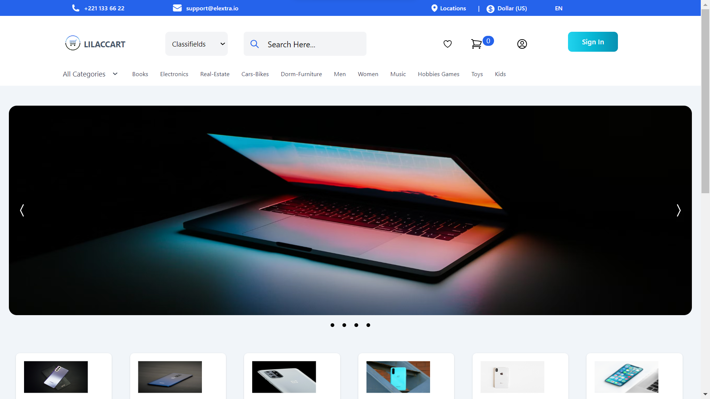
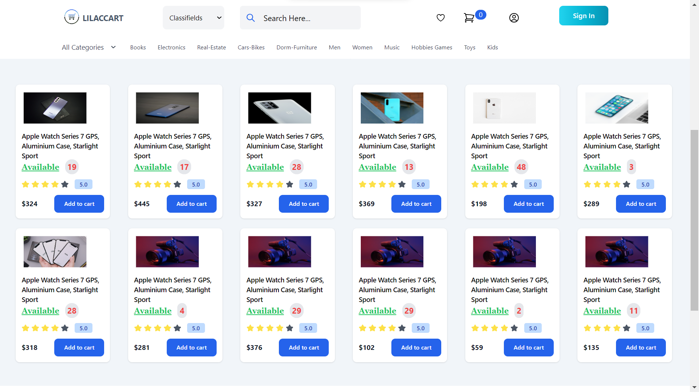
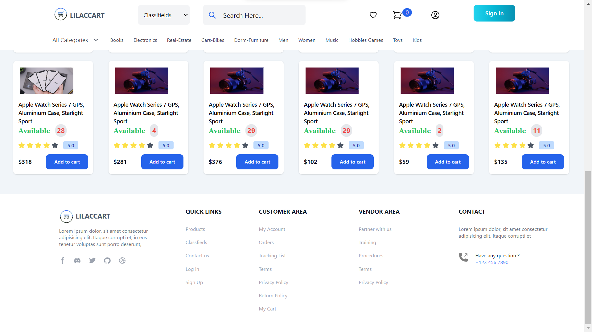
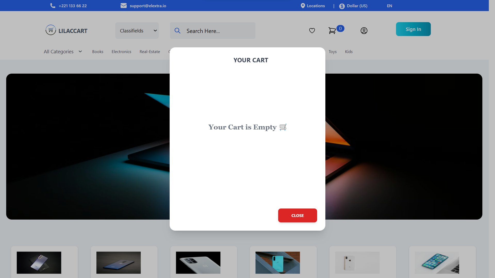
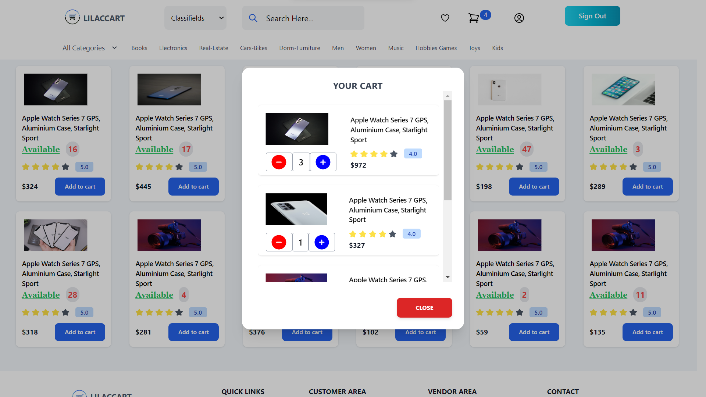
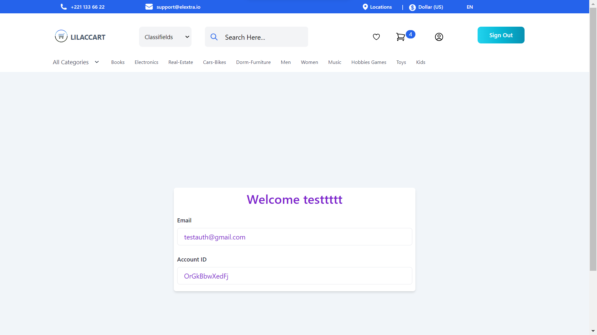
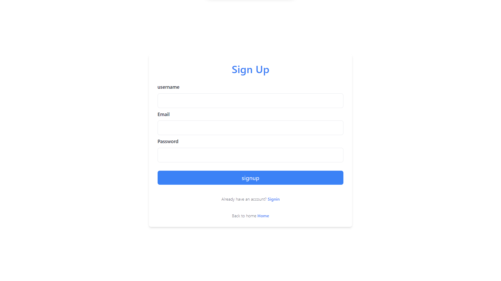
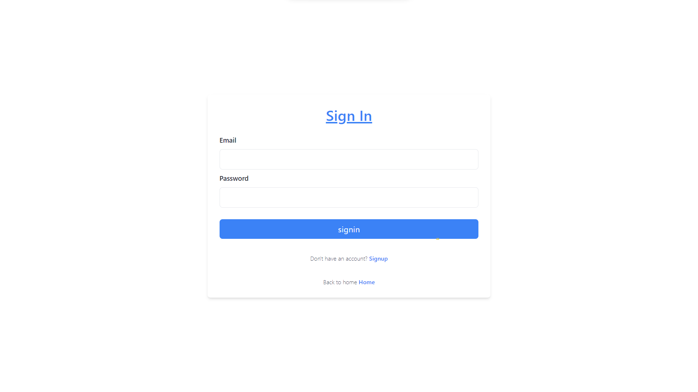
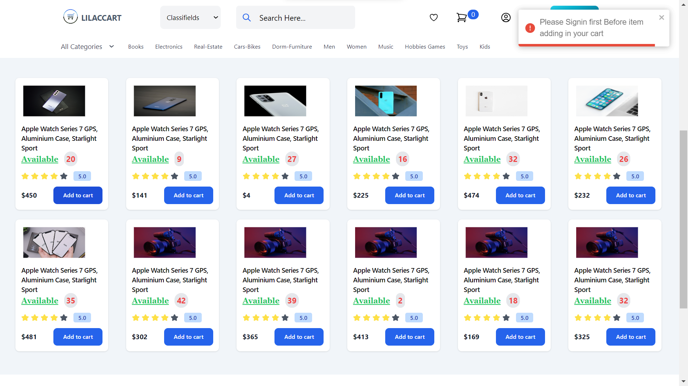

# Machine Test (Lilac Info Tech)

## Description

Ecommerce Task

An ecommerce store built with MERN stack, and LOGIN and LOGOUT Products Add to the cart and Deletet the cart

1. Buyers browse the store categories, products and brands

- features:

  - It's Typescript based project
  - Node provides the backend environment for this application
  - Express middleware is used to handle requests, routes
  - Login Logout based on token method
  - This token is expired in 24 Hours
  - Auth token stored in browser local storage
  - Design fully developed under Tailwind css and Some third party packages
  - React for displaying UI components
  - Rxjs like(Redux) to manage application's state
  - Rxjs to handle asynchronous redux actions

- Project Descroption:
  - If you want to items add in your cart you should before login
  - You can Add a Product and delete in your cart
  - If you Delete item in your cart automatically item updated in selling products

## Database

- This Project need to run Mongodb is Mandatory

## Clone Project

Some basic Git commands are:

```
$ git clone https://github.com/aakashDev000/mernstackecommerce/tree/main/backend/ecommercetsapi
```

## Install Backend Packages

Some basic Git commands are:

```
$ cd backkend/ecommercetsapi
$ npm install
```

## Setup

```
 Create .env file that include:
  * Go to `/backend/ecommercetsapi/.env` file and given your mongourl

  $ .env --> MONGO_URL = your_mongodb_url ("mongodb://127.0.0.1/localdev")
```

## Start Express Server

- Build code for development (It's Mandatory)

```
$ tsc -w

```

- successfully installled then start express server

```
$ npm run start
```

## Install Frontend Packages

Some basic Git commands are:

```
$ cd frontend/ecommercetsapp
$ npm install
```

## Start React Project

```
$ npm run start
```

## Languages & tools

- [Node](https://nodejs.org/en/)

- [Typescript](https://www.typescriptlang.org/)

- [Express](https://expressjs.com/)

- [MongoDb](https://www.mongodb.com/)

- [React](https://reactjs.org/)

## Project Completed Screen shots attached here










